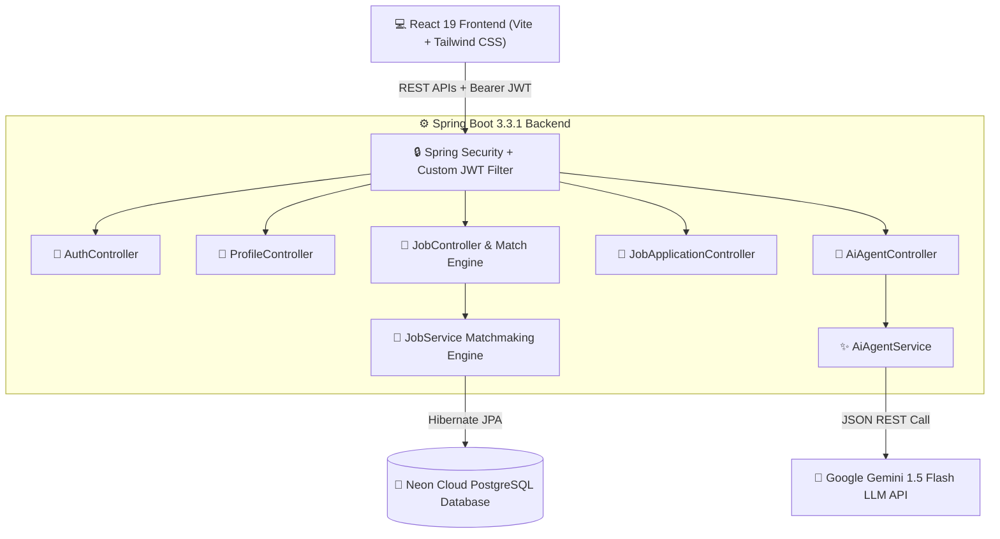

# 🚀 DevConnect Jobs | AI Matchmaking Tech Recruitment Platform

> An industry-standard, full-stack recruitment platform and AI career assistant built with **Java 17, Spring Boot 3.3.1, PostgreSQL (Neon Cloud)**, **Google Gemini 1.5 LLM**, and **React 19 (Vite + Tailwind CSS)**.

---

## 📐 System Architecture



---

## ✨ Key Features & Technical Highlights

### 1. 🧠 Real-Time Skill Matchmaking Algorithm
- Calculates live percentage compatibility scores between candidate skill vectors and recruiter job postings.
- Tokenizes, normalizes, and intersects candidate skills against job titles and descriptions to produce percentage match scores (`60% Match`, `90% Match`) and highlights matching skill tags (`✓ Java`, `✓ Spring Boot`, `✓ PostgreSQL`).

### 2. 🤖 Google Gemini AI Career Agent
- **Skill Gap Analysis**: Identifies missing high-demand tech skills (`Docker`, `Redis`, `AWS`) and explains how learning them boosts candidate match scores.
- **AI Cover Letter Writer**: Generates personalized, professional cover letters tailored to any job listing.
- **AI Mock Technical Interview Coach**: Generates targeted technical interview questions & model answers.
- **Dynamic API Key Drawer**: Allows users to input their free Google Gemini API Key dynamically or use environment variables.

### 3. 🔒 Custom JWT Authentication & Security
- Handcrafted JWT Authentication filter (`JwtFilter.java`) intercepting HTTP headers.
- Password hashing with **BCryptPasswordEncoder**.
- Stateless session management with custom CORS policy.

### 4. 🎨 Modern High-Contrast Light Mode UI
- Responsive dashboard built for both Candidates and Recruiters.
- **Candidate View**: AI recommendations feed, job exploration filters by domain role (`SDE`, `Data Analyst`, `Product Manager`, `DevOps`), and live application tracking.
- **Recruiter View**: Published listings manager, applicant reviewer, cover note reader, resume inspector, and hiring stage status updater (`APPLIED` → `SHORTLISTED` → `INTERVIEWING` → `OFFERED` → `REJECTED`).

---

## 🧪 API Documentation

### 🔑 Authentication APIs
| Method | Endpoint | Description |
|---|---|---|
| `POST` | `/api/auth/register` | Register new Candidate or Recruiter with BCrypt password |
| `POST` | `/api/auth/login` | Authenticate user & issue signed JWT token |

### 👤 Profile APIs
| Method | Endpoint | Description |
|---|---|---|
| `GET` | `/api/profiles/{userId}` | Fetch candidate profile details |
| `PUT` | `/api/profiles?userId={userId}` | Update candidate bio, skill matrix, college, CGPA, and resume URL |

### 💼 Job & Matchmaking APIs
| Method | Endpoint | Description |
|---|---|---|
| `GET` | `/api/jobs` | List all open job postings |
| `GET` | `/api/jobs/role/{role}` | Filter jobs by domain role (`SDE`, `DATA_ANALYST`, etc.) |
| `GET` | `/api/jobs/{id}` | Get detailed job posting information |
| `GET` | `/api/jobs/recommendations?candidateId={id}` | Calculate skill-based job match score & recommendations |
| `POST` | `/api/jobs?recruiterId={id}` | Publish a new job opportunity (Recruiter only) |

### 📝 Job Application APIs
| Method | Endpoint | Description |
|---|---|---|
| `POST` | `/api/applications?candidateId={id}` | Submit job application with cover letter & resume |
| `GET` | `/api/applications/candidate/{candidateId}` | List applications submitted by candidate |
| `GET` | `/api/applications/job/{jobId}?recruiterId={id}` | List candidates who applied for a job (Recruiter) |
| `PUT` | `/api/applications/{id}/status?status={STATUS}&recruiterId={id}` | Update applicant hiring stage |

### 🤖 AI Agent APIs
| Method | Endpoint | Description |
|---|---|---|
| `POST` | `/api/ai/career-agent` | Interact with Google Gemini AI Agent (`ANALYZE_SKILLS`, `GENERATE_COVER_LETTER`, `INTERVIEW_PREP`, `CHAT`) |

---

## 📝 Resume Project Bullet Points (For SDE Applications)

```markdown
• Designed and developed DevConnect Jobs, an AI-assisted recruitment platform using Java 17, Spring Boot 3.3, PostgreSQL (Neon Cloud), and React 19.
• Implemented a real-time Skill Matchmaking Algorithm calculating percentage compatibility scores between candidate skill matrices and recruiter job descriptions.
• Integrated Google Gemini 1.5 LLM REST API to deliver automated AI skill gap analysis, custom cover letter generation, and targeted technical interview preparation.
• Built stateless security layer leveraging JWT filters, BCrypt password encryption, and UUID-based PostgreSQL database entity relationships.
```

---

## 🛠️ Local Installation & Setup

### Prerequisites
- Java 17 JDK
- Node.js v18+ & npm
- PostgreSQL (or Neon Cloud PostgreSQL URL)

### 1. Backend Setup
```bash
cd backend

# Set Database Environment Variables
export DATABASE_URL="jdbc:postgresql://<your_postgres_host>/neondb?sslmode=require"
export DATABASE_USERNAME="<your_db_username>"
export DATABASE_PASSWORD="<your_db_password>"

# Run Spring Boot Server
./mvnw spring-boot:run
```

### 2. Frontend Setup
```bash
cd frontend

# Install Dependencies
npm install

# Launch Dev Server
npm run dev -- --port 3000
```

Access the portal in your browser at `http://localhost:3000`.
